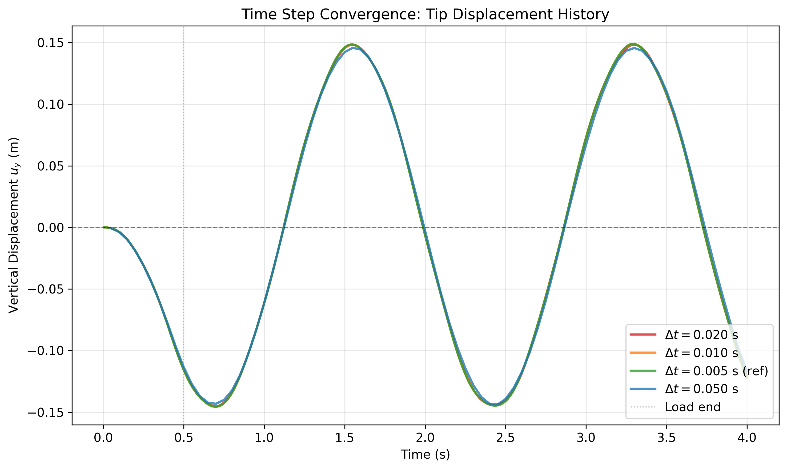
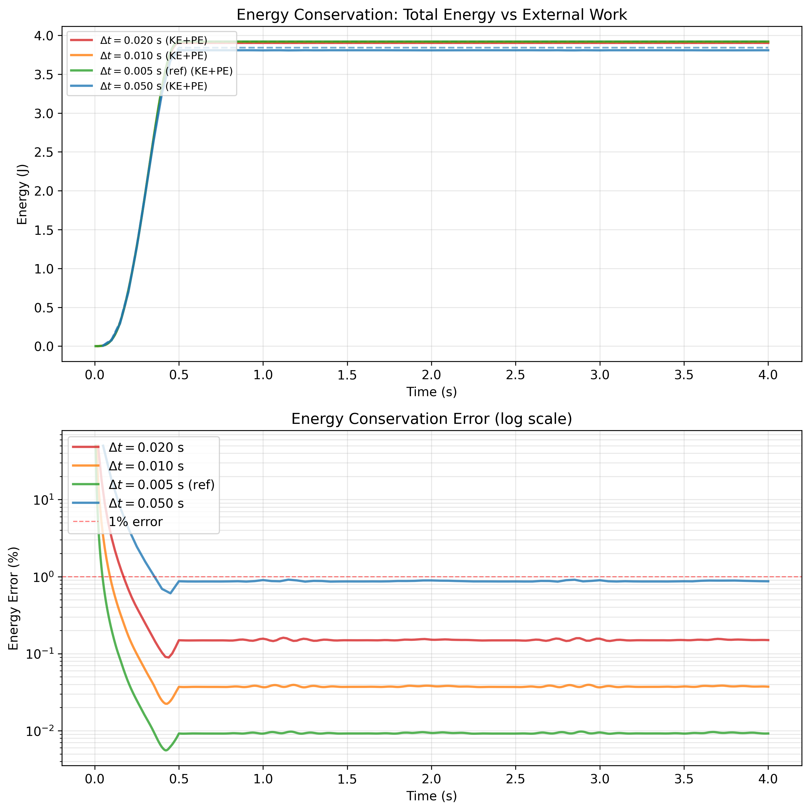

# Nonlinear Elastic Dynamic Problem

Dynamic simulation of a 2D plane-stress Neo-Hookean cantilever beam in `deal.II`, using:
- Newmark-beta time integration (`beta = 0.25`, `gamma = 0.5`)
- Newton-Raphson nonlinear solve
- Half-sine pulse loading at the free end

## deal.II Version

This project is configured for **deal.II 9.4.0** 

## Build and Run

```bash
cmake -S . -B build -DDEAL_II_DIR=/path/to/dealii
cmake --build build -j
./build/NeoHookElasticProblem beam.prm
```

Main outputs are written to `output_benchmark/` (VTU/PVD files and CSV logs).

## Results

### Beam Response Animation


Top: beam deflection animation.  
Bottom: beam-tip displacement over time.

### Time-Step Convergence (Displacement)



Displacement history for different time steps, showing temporal convergence.

### Energy Conservation



Total energy vs time and energy-conservation error (log scale) for different time steps.  
The error decreases as the time step is reduced.
